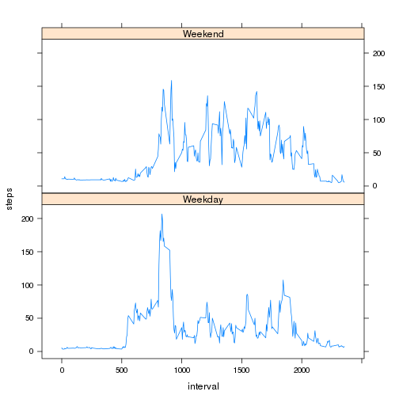

# Reproducible Research: Peer Assessment 1


## Loading and preprocessing the data
Load the data into memory

```r
setwd("~/Dropbox/computer_projects/R/coursera/RepData_PeerAssessment1")
raw_data = read.csv("activity.csv")
raw_data$date <- as.Date(raw_data$date, format="%Y-%m-%d")
```

Remove rows with NA in the column called "step""

```r
data = na.omit(raw_data)
```


## What is mean total number of steps taken per day?
Aggregate total number of steps for each day. Remove NA entries because at these days there were no steps registerd (or only NA).

```r
require(plyr)
```

```
## Loading required package: plyr
```

```r
total_steps = ddply(data, "date", summarize, steps = sum(steps))
```

Make a Histogram of the total number of steps taken each day

```r
hist(total_steps$steps, xlab="Number of steps per day", main="Steps per day")
```

 

Print the mean and the avarage number of steps per day

```r
mean_steps = mean(total_steps$steps)
median_steps = median(total_steps$steps)
mean_steps
```

```
## [1] 10766
```

```r
median_steps
```

```
## [1] 10765
```


## What is the average daily activity pattern?
Calculate number of steps per interval, averaged over the days

```r
steps_per_interval = ddply(data, "interval", summarize, steps = mean(steps))
```

Plot the average number of steps per interval

```r
plot(x=steps_per_interval, type="l", xlab="Interval", ylab="Average number of steps", main="Steps per interval")
```

 


```r
max(steps_per_interval$steps)
```

```
## [1] 206.2
```

```r
steps_per_interval$interval[which.max(steps_per_interval$steps)]
```

```
## [1] 835
```
Interval 835 has the maximum mean of 206.2 steps 


## Imputing missing values
Find the index for entries NA for steps
The number of missing values is 2304

```r
missing_index = is.na(raw_data$steps)
```

Strategy for filling the NA vales: use mean values for the day.
Obtain the intervals corresponding to the missing data
Lookup the mean steps for these intervals

```r
missing_intervals = subset(raw_data[missing_index, ], , select= interval)
interpolate = merge(x=missing_intervals, y=steps_per_interval, by="interval", all.x=TRUE)
```


Merge the interpolated data into the raw dataset

```r
corrected_data = raw_data
corrected_data[missing_index, "steps"] <- interpolate$steps
```


```r
hist(data$steps, main="Histogram of steps with missing values removed", xlab="Number of steps")
```

 


```r
hist(corrected_data$steps, main="Histogram of steps with missing values substituted", xlab="Number of steps")
```

 


```r
corrected_total_steps = ddply(corrected_data, "date", summarize, steps = sum(steps))
mean(corrected_total_steps$steps)
```

```
## [1] 10766
```

```r
median(corrected_total_steps$steps)
```

```
## [1] 11015
```


The median has become a lot bigger, whereas the mean stays the same. Also the are visually different. The impact of the missing data on the esimate of the total daily number of steps is not that small.

## Are there differences in activity patterns between weekdays and weekends?
Create a factor for weekday and weekend

```r
corrected_data$weekend <- factor((weekdays(corrected_data$date) == "Saturday") + (weekdays(corrected_data$date) == "Sunday"), labels = c("Weekday", "Weekend"))
```


```r
steps_by_weekpart = ddply(corrected_data, c("interval", "weekend"), summarize, steps = mean(steps))
```


```r
library(lattice)
xyplot(steps ~ interval | weekend , data = steps_by_weekpart, layout=c(1, 2), type="l")
```

 

